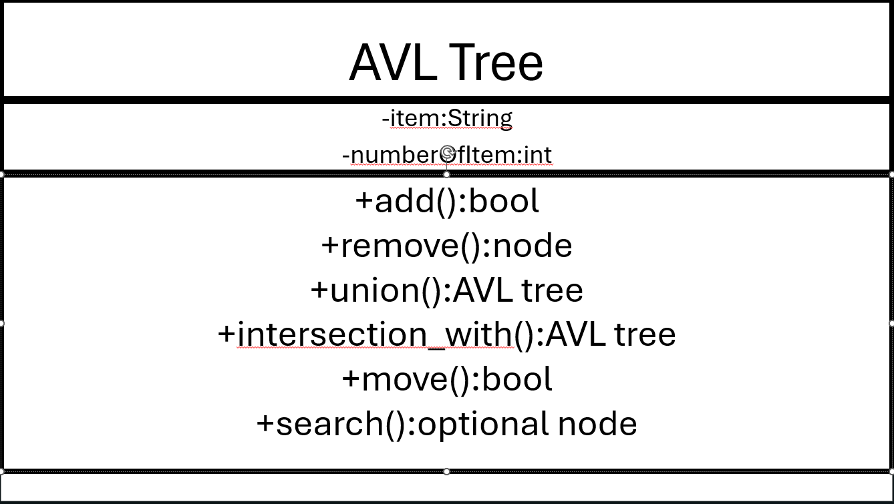

# MultiSet Design
## Introduction
To best build an inventory for this open-world game, an AVT tree will be implemented. The AVT tree will hold a string key and an int that will hold the item amount. The string will be the item's name that was collected. The Format in the class will look like  **AVLTree (string item, int amount)**. The inventory will be for the player in this single-player open-world game. With the AVT tree implementation, there will be pros and cons, but the AVT tree is the best fit for this project.

## Design Philosophy 
The AVL tree will be used for a number of reasons. The most important thing is that the player's inventory is going to be search-based. So, for example, if someone were to look through their inventory, they would just search for the item by name. This search-based inventory will add to the game's difficulty because players will have to remember what they pick up. The user will be the game player, and accessing the AVL tree will be almost direct. The client that the code will be made for is the game developers themselves. AVL trees have the best search function and will be efficient. The AVL tree will also be able to take the item out of inventory to drop or move to the player's hot bar or the armor that they are wearing. The efficiency of moving the item will also be good. 

## Core Operation
The AVL tree will be implemented to store items in the player's inventory. It will be the only items that the player will be able to move across the map with. It will be a blind or a search inventory, making it so the player can only search for items and not see the whole inventory graphically. The inventory will drop when the player dies. This means they can get all of their items back. The inventory will also have a max space. The maximum space will be on the number of keys and how much of one items they have. The max will be 200 keys, and the amount of each key will be 100. When combining inventories that will go over the max values, the user will get the root and as far down the AVL tree as they can hold for keys, and will drop anything with a combination over 100 of those items. Then the user can search and remove items to get what they want from the dead inventory into their new inventory. The player will be able to search and move items to their armor or their hot bar to use the items. 

The AVL tree should get a search of **O(log(n))** as confirmed by this author[1] and a drop item or move item time complexity of **O(log(n))**. The place where the item inventory will be slow is when the player combines their inventory with their player's dropped dead inventory. The AVL tree supports the functions of adding, dropping, or moving well. The only problem occurred with the combination of inventories. 

### This is what a player search would look like in pseudo-code.
```
//player string that was inputed in the inventory search bar
getInput(string searchingFor)

//calling the search function on the inventory...  this function has the option to return a node
inventory.search(searchingFor)

```

This is the code for a search made by a player

## Set Operations
The set operations that would be useful are the intersection and the union. The intersection will only happen when a player picks up an item or combines two inventories. When a player picks up items from loot, the intersection will look and see what are the same and just add to the item count up to 100, and if it is not in the tree, it will just insert them up to 200 items. The intersection will also be used before a union of the new inventory and dead inventory to give the player up to 100 items that intersect. This website shows what a union does with a C++ example[2].

The union will only happen when a player goes to get their dead inventory and will unionize as much as it can, up to 200, after the intersection happens to give the player up to 100 items combined from two inventories. The union will basically add the maximum amount of items that will be stored after combining items with the same key. So that means it will not be an exact union, but there is a chance it could be. It is possible to union AVL trees as this author does [3]. 

### This is what combining two inventories would look like in pseudo-code.

```
//function adds items up to 100 if intersected and returns the new AVLtree of inventory  
AVLtree intersection_with(AVLtree deadInventory, AVLTree inventory)  

//checks if it can do a direct union instead of adding up to the max amount of possible from deadInventory  
if(both inventories less then 200 keys){  
//direct union of trees  
AVLtree union(AVLtree deadInventory, AVLTree inventory)  
}
```

This shows part of the picUpDeadInventory function. This part will only run fully if both inventories can be directly union.

## Extension Feature
The extension feature added to the AVL tree will be to move. This will move a node to the ground, which is the drop function, or to the armor or hot bar to be used.
The move extension will make it so the player can interact with the items in their inventory, and they will be able to wear armor if they collect some. The move will just be a removal while adding the node to a different location. The complexity will still be **O(log(n))** and will just delete the node from the AVL tree inventory. 

### This is what move will look like in pseudo-code.

```
// the use will first get the node from a search then do this

inventory.move(node, AVLtree armor){
if(it is armor and slot not full){
armor.add(node)
inventory.remove(node) }
}

```

This is the code for moving to armor.

## UML Diagram

All the functions are public, so the game engine can use them willingly. The key and value are private because these should only change through the function of the class.

## Trade-off Analysis
The sequence or linked list was another option for the structure of the inventory. Since this was a search-based inventory, and search for a linked list is **O(n)**, the sequence could not outperform the AVL tree. Along those lines it would also be slower to find items to remove them. That is basically what the inventory needs to do it the AVL tree is a better fit. The linked list would be easier to union with code-wise, but that would only happen every once and a while in gameplay. Both would be close is size complexity and would have a cap of 200 nodes.

### This is a chart of the time complexities of both the Sequence and AVL tree, and the basic functions needed for inventory

|        |Sequence|AVL tree |
|:------:|:------:|:-------:|
|move()  |O(n)    |O(log(n))|
|remove()|O(n)    |O(log(n))|
|search()|O(n)    |O(log(b))|
|Union() |O(n * m)|O(n * m) |

The n stands for the size of one, and m is the size of the other. 
## Alternative Design Sketch
If the inventory were a sequence, it would be a displayed inventory. All the nodes would be displayed in a scrollable list to function as the user's inventory. This would take away from the game's difficulty, and it would be easier for the player to move and remove items. The key and value in the sequence would be the same as in the AVL tree. With this design, players would still also union with dead inventories, and it would be the same time complexity. 

## Evaluation Plan
The first test would be to add to the inventory and then find and remove that item. Then test the move function to make sure it is removed and added to the correct AVL tree. Also, test that an item's value gets added to if they pick up another of that item. Then test to see if it only picks up 100 and exactly 100 of a single item. Next, test the union and intersection to see if it will only union at 200 or less, and the intersection works. Finally, test the code that just takes the first items, so many items after an intersection with the dead inventory. 

## Conclusion
The AVL tree, as a search-only inventory, works perfectly. The design is simple and uses the best part of the AVL tree, the **O(log(n))** search. The trade-offs are game difficulty and the union speed. The space complexity does not matter in the design because the tree has a maximum size. This design is also effective at moving and removing items from the inventory. The design works well because the player will be able to use the inventory without knowing what it is doing. The design takes everything and makes a class inventory that works fit the game. The design takes the simple thing of searching an AVL tree and builds it into an inventory. 

## Sources
[1] Information and control | international conference on foundations of computation theory | sciencedirect.com by elsevier, https://www.sciencedirect.com/journal/information-and-control/vol/64/issue/1 (accessed Dec. 5, 2025).  
[2] “Union declaration,” cppreference.com, https://en.cppreference.com/w/cpp/language/union.html (accessed Dec. 5, 2025).  
[3] G. Blelloch, D. Ferizovic, and Y. Sun, “Joinable parallel balanced binary trees,” ACM Transactions on Parallel Computing, vol. 9, no. 2, pp. 1–41, Apr. 2022. doi:10.1145/3512769 
